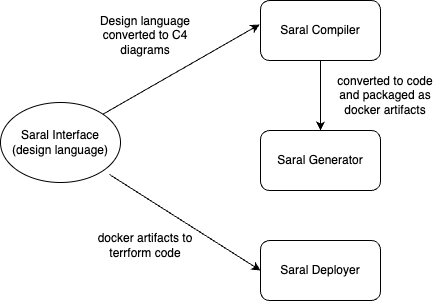

---
# Feel free to add content and custom Front Matter to this file.
# To modify the layout, see https://jekyllrb.com/docs/themes/#overriding-theme-defaults

layout: page
title: Architecture
nav_order: 3
---
# Design Components
Saral is a higher level of abstraction on existing technologies. It will parse the application design as Domain driven design and generate artifacts in existing technologies to meet those requirements.

## Planes
- Data plane: All the application logic is defined here. 
- Control plane: This defines the infrastructure required to host the application.
- Networking plane: This defines the isolation boundaries of the data workflows. e.g. tenant boundaries in a multi-tenant application. geographical boundaries for data residency etc. 

## Instruction set
Like any other compiler, Saral compiler has a defined instrcutions set. Initially the instruction set is small based on the different types of applications that can be built today. As more and more new applications come to light, the instructions set will grow.

The instruction is based on `Domain Driven Design`

### Examples of instruction set

| Instruction | Parameter | Parameter Value | Technology |
| ----------- | --------- | --------------- | ---------- |
| Design | Constructs | Domain | Core, Generic, Supporting |
|        | Constructs | Sub-Domain |     |
|        | Constructs | Module |     |
|        | Constructs | Aggregates |     |
|        | Constructs | Entities |     |
|        | Constructs | Service |     |
|        | Constructs | Respository |     |
|        | Constructs | Factory |     |
|        | Constructs | Event |     |
| Datastore | Type | Relational | Mysql, Oracle, PgSQL |
|          | Type | object store | AWS S3, Oracle Object store, Azure Blob|
|          | Type | Cache | Memcache, redis|
|          | Type | Streaming | Youtube, zoom |
|          | Type | Blockchain | 
| Algorithms | Type | Custom | Scala, python, js |
|            | Type | Template | AWS functions, OCI functions etc |
| Interaction Interface | Type | Website | HTML | 
|                       | Type | Mobile app | Android, IOS | 
|                       | Type | Console | Terminal, File |
| External Service | Type | SaaS | Salesforce, Booking | 
|                       | Type | PaaS | Microsoft, Databricks | 
|                       | Type | Iaas | Azure, GCP, AWS |

## Grammar
Grammar is important to establish relationships between instructions in the requirements. It will decide how the different items in the application interact with each other

Saral uses following technologies
- Java for backend
- Docker for containers
- Mysql for RDBMS
- Mongo for document DB
- Kafka for event queues and simple queues
- Reactjs for frontend
- OpenApi for API contracts implemented as JSON payloads
- Terraform for Infrastructure as code
- Kubernetes as deployment orchestrator