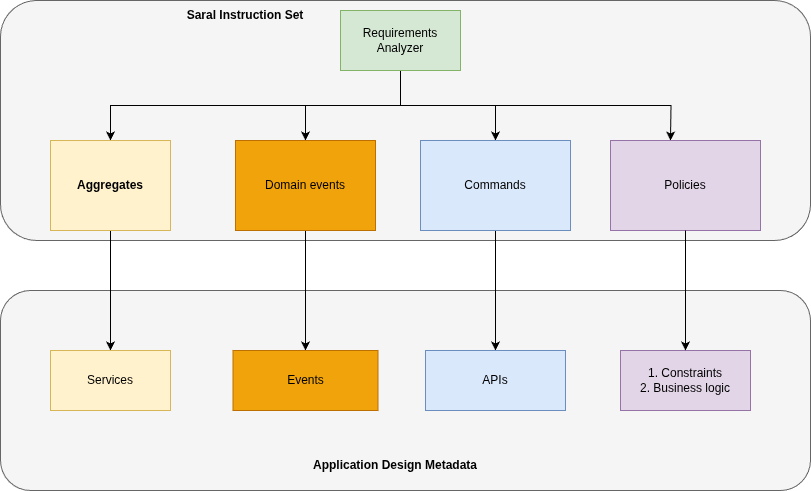
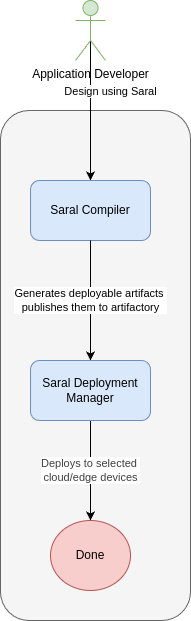

---
# Feel free to add content and custom Front Matter to this file.
# To modify the layout, see https://jekyllrb.com/docs/themes/#overriding-theme-defaults

layout: page
title: Getting Started
nav_order: 2
---
## Getting Started with Saral

### Modelling
Start with modelling user application using [Domain driven design](https://www.domainlanguage.com/) approach. [Event Storming](https://www.eventstorming.com/) helps with this design approach. The artifcats generated from Event storming can be directly used to create a Saral app.

### Application Lifecycle
Once the application is created, developers have to manage it and continuously evolve it. Saral manages this process implicitly by providing easy to use handles as mentioned below. 

### Sample recordings
[Project structure - Video](images/app-structure.webm)

[Project Describe - Video](images/describe.webm)