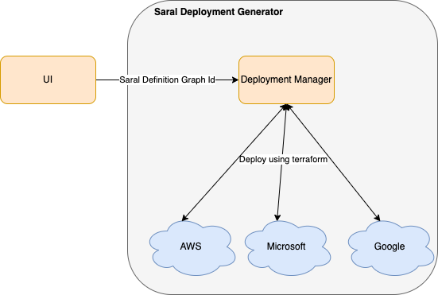
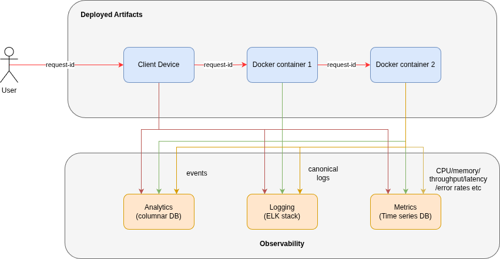

---
# Feel free to add content and custom Front Matter to this file.
# To modify the layout, see https://jekyllrb.com/docs/themes/#overriding-theme-defaults

layout: page
title: Operations
nav_order: 6
---

## Deployment
Saral helps in deploying the application as a monolith or microservices on a specified cloud. It also enables running the complete applciation on developer machine. 

## Observability
Saral incorporates obeservability aspects to help developers monitor the usage and performance of their applications.
